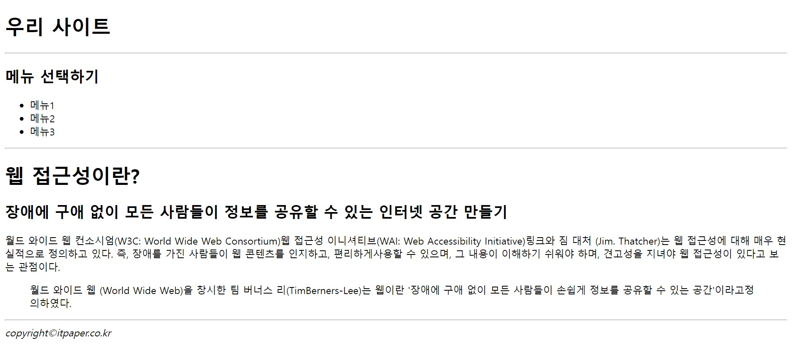

# 김다보미 컴포넌트 구조 과제
> 22-10-17

## 문제1.
### index.js
```javascript
import React from 'react';
import ReactDOM from 'react-dom/client';

import App from './App';


const root = ReactDOM.createRoot(document.getElementById('root'));
root.render(
  <React.StrictMode>
    <App />
  </React.StrictMode>
);
```

### App.js
```javascript
import React from "react";
import Contain from "./Contain";

function App() {
  return (
    <Contain />
  );
};

export default App;
```

### Contain.js
```javascript
import React from "react";
import Header from "./Header";
import Content from "./Content";
import Footer from "./Footer";

const Contain = () => {
    return (
        <div>
            <Header />
            <hr />
            <Content />
            <hr />
            <Footer />
        </div>
    );
};

export default Contain;
```

### Header.js
```javascript
import React from "react";

const Header = () => {
    return (
     <h1>우리 사이트</h1>
    );
};

export default Header;
```

### Content.js
```javascript
import React from "react";
import Sidebar from "./Sidebar";
import Main from "./Main";

const Content = () => {
    return (
        <div>
            <Sidebar />
            <hr />
            <Main />
        </div>
    );
};

export default Content;
```

### Sidebar.js
```javascript
import React from "react";

const Sidebar = () => {
    return (
        <div>
            <h2>메뉴 선택하기</h2>
            <ul>
                <li>메뉴1</li>
                <li>메뉴2</li>
                <li>메뉴3</li>
            </ul>
        </div>
    );
};

export default Sidebar;
```

### Main.js
```javascript
import React from "react";

const Main = () => {
    return (
        <div>
            <h1>웹 접근성이란?</h1>
            <h2>장애에 구애 없이 모든 사람들이 정보를 공유할 수 있는 인터넷 공간 만들기</h2>
            <p>
            월드 와이드 웹 컨소시엄(W3C: World Wide Web Consortium)웹 접근성 이니셔티브(WAI: Web Accessibility Initiative)링크와 짐 대처 (Jim. Thatcher)는 웹 접근성에 대해 매우 현실적으로 정의하고 있다. 즉, 장애를 가진 사람들이 웹 콘텐츠를 인지하고, 편리하게사용할 수 있으며, 그 내용이 이해하기 쉬워야 하며, 견고성을 지녀야 웹 접근성이 있다고 보는 관점이다.
            </p>
            <blockquote>
                <p>월드 와이드 웹 (World Wide Web)을 창시한 팀 버너스 리(TimBerners-Lee)는 웹이란 '장애에 구애 없이 모든 사람들이 손쉽게 정보를 공유할 수 있는 공간'이라고정의하였다.</p>
            </blockquote>
        </div>
    );
};

export default Main;
```

### Footer.js
```javascript
import React from "react";

const Footer = () => {
    return (
        <div>
            <address>copyright&copy;itpaper.co.kr</address>
        </div>
    );
};

export default Footer;
```

### 실행화면
