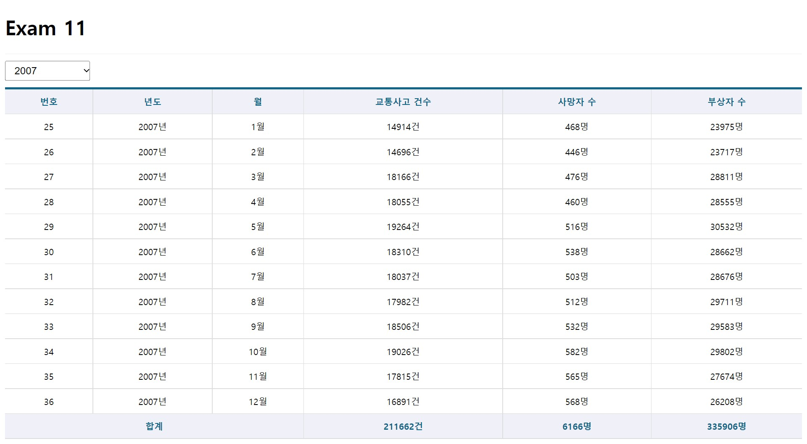

# 김다보미 React-Axios-hooks 과제
> 22-11-04

## index.js / useMountedRef.js / Spinner.js / Table.js 생략

## App.js
```javascript
import React,{memo} from 'react';
import TrafficAcc from './pages/TrafficAcc';

const App = memo(() => {
  return (
    <div>
      <h1>Exam 11</h1>
      <TrafficAcc />
    </div>
  );
});

export default App;
```

## TrafficAcc.js
```javascript
import React,{memo,useState,useCallback,useEffect} from 'react';
import styled from 'styled-components';
import useAxios from 'axios-hooks';
import Spinner from '../components/Spinner';
import Table from '../components/Table';
import useMountedRef from '../hooks/useMountedRef';
// 드롭다운을 배치하기 위한 박스
const SelectContainer = styled.div`
    position: sticky;
    top: 0;
    background-color: #fff;
    border-top: 1px solid #eee;
    border-bottom: 1px solid #eee;
    padding: 10px 0;
    margin: 0;
    
    select {
        margin-right: 15px;
        font-size: 16px;
        padding: 5px 10px;
    }
`;

const TrafficAcc = memo(() => {
  const [{data,loading,error},refetch] = useAxios('/traffic_acc/');

  const [state, setState] = useState({
    year: ''
  });

  const mountedRef = useMountedRef();


  // 드롭다운 변경 시 호출되는 이벤트
  const onSelectChange = useCallback(e => {
    e.preventDefault();

    const current = e.target;
    const key = current.name;
    const value = current[current.selectedIndex].value;

    // 상태값 갱신
    const newState = {...state, [key]:value};
    setState(newState);
    console.log(newState);
  },[state]);
  
  useEffect(() => {
    if(mountedRef.current) {
      const params = {};
      for (const key in state) {
        if (state[key]) {
          params[key] = state[key];
        }
      }
      refetch({
        params: params
      });
    }  
  },[mountedRef,refetch,state]);

  if (error) {
    console.error(error);

    // 컴포넌트 자체가 함수이고, 함수가 실행도중 리턴을 하므로 이 내용을 화면에 표시하고 컴포넌트의 실행은 중단된다.
    return (
        <div>
            <h1>{error.code}Error!</h1>
            <hr />
            <p>{error.message}</p>
        </div>
    )
  }

  return (
    <div>
      <Spinner loading={loading} />

      <SelectContainer>
        <select name='year' onChange={onSelectChange}>
          <option value=''>-- 년도 선택 --</option>
          <option value='2005'>2005</option>
          <option value='2006'>2006</option>
          <option value='2007'>2007</option>
          <option value='2008'>2008</option>
          <option value='2009'>2009</option>
          <option value='2010'>2010</option>
          <option value='2011'>2011</option>
          <option value='2012'>2012</option>
          <option value='2013'>2013</option>
          <option value='2014'>2014</option>
          <option value='2015'>2015</option>
          <option value='2016'>2016</option>
          <option value='2017'>2017</option>
          <option value='2018'>2018</option>
        </select>
      </SelectContainer>
      <Table>
        <thead>
          <tr>
            <th>번호</th>
            <th>년도</th>
            <th>월</th>
            <th>교통사고 건수</th>
            <th>사망자 수</th>
            <th>부상자 수</th>
          </tr>
        </thead>
        <tbody>
          {data && data.map (({
            id,year,month,accident,death,injury
          },i) => {
            return (
              <tr key={id}>
                <td>{id}</td>
                <td>{year}년</td>
                <td>{month}월</td>
                <td>{accident}건</td>
                <td>{death}명</td>
                <td>{injury}명</td>
              </tr>
            );
          })}
        </tbody>
        <tfoot>
          <tr>
            <th colSpan='3'>합계</th>
            <th>{data && data.reduce((acc,cur) => acc + cur.accident,0)}건</th>
            <th>{data && data.reduce((acc,cur) => acc + cur.death,0)}명</th>
            <th>{data && data.reduce((acc,cur) => acc + cur.injury,0)}명</th>
          </tr>
        </tfoot>
      </Table>
    </div>
  );
});

export default TrafficAcc;
```

## 실행화면
