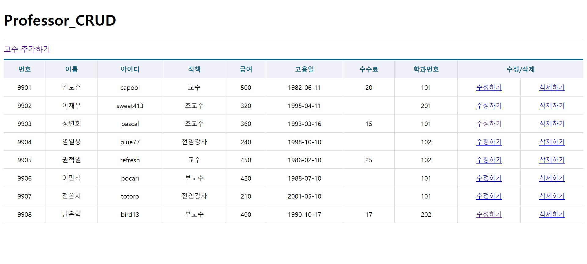
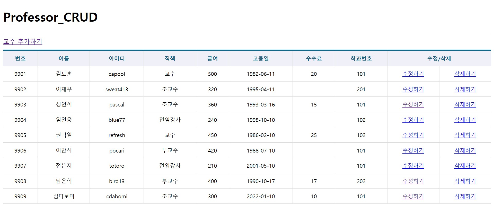
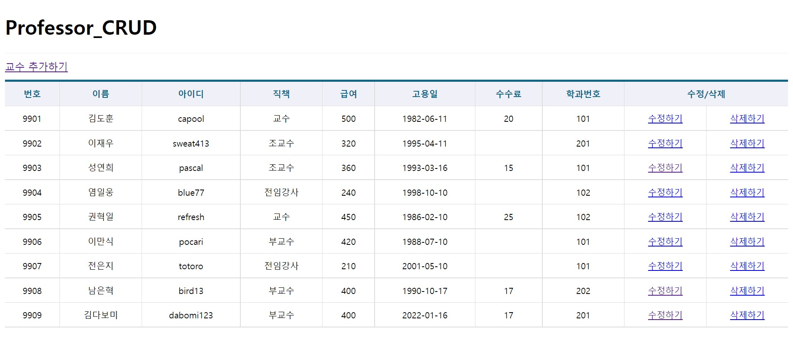

# 김다보미 AxiosHooks_CRUD 과제
>22-11-08

## index.js / Spinner.js / Table.js 생략

## App.js
```javascript
import React,{memo} from 'react';
import {Routes,Route} from 'react-router-dom';
import ProfessorList from './pages/ProfessorList';
import ProfessorAdd from './pages/ProfessorAdd';
import ProfessorEdit from './pages/ProfessorEdit';

const App = memo(() => {
  return (
    <div>
      <h1>Professor_CRUD</h1>
      <Routes>
        <Route path='/' exapt={true} element={<ProfessorList />} />
        <Route path='/add' element={<ProfessorAdd />} />
        <Route path='/edit/:id' element={<ProfessorEdit />} />
      </Routes>
    </div>
  );
});

export default App;
```

## ProfessorList.js
```javascript
import React,{memo,useCallback,useEffect} from 'react';
import useAxios from 'axios-hooks';
import styled from 'styled-components';
import {NavLink} from 'react-router-dom';
import Spinner from '../components/Spinner';
import Table from '../components/Table';


const LinkContainer = styled.div`
  position: sticky;
  top: 0;
  background-color: #fff;
  border-top: 1px solid #eee;
  border-bottom: 1px solid #eee;
  padding: 10px 0;
`;

const TopLink = styled(NavLink)`
  margin-right: 15px;
  display: inline-block;
  font-size: 16px;
  padding: 7px 10px 5px 10px;
  border: 1px solid #ccc;
  background-color: #fff;
  color: #000;
  text-decoration: none;
  &:hover {
    background-color: #06f2;
  }
`;

const ProfessorList = memo(() => {
  // 화면에 표시할 성적표 데이터를 저장하기 위한 상태 변수
  const [professor, setProfessor] = React.useState([]);


  // 백엔드로부터 데이터 불러오기 - 자체 캐기시능 방지함
  // 삭제를 위한 useAxios와 구조분해 변수명이 겹치는 것을 방지하기 위해 변수이름을 loading1로 변경하여 처리
  const [{data,loading:loading1,error},refetch] = useAxios('/professor/', {
    // 쓰기, 수정 페이지에 방문하여 데이터가 변경되더라도 다시 목록페이지로 돌아오면 Axios는 캐시된 json을 활용하기 때문에 데이터의 변경사항이 화면에 반영되지 않는다. 이를 방지하기 위해 캐시를 사용하지 않도록 옵션으로 명시해야 한다.
    useCache: false
  });


  // axios-hook에 의해 생성된 상태값인 data가 변경되었을때 (ajax로딩이 완료되었을 때) 실행될 hook 
  useEffect(() => {
      // ajax의 결과를 화면에 표시하기 위한 상태값에 복사한다.
      setProfessor(data);
  },[data]);


  // 백엔드로부터 데이터 삭제하기 - 자체 캐기시능 방지, 삭제 버튼 이벤트에 의해 호출되어야 하므로 메뉴얼 실행 모드
  // 조회를 위한 useAxios와 구조분해 변수명이 겹치는 것을 방지하기 위해 변수이름을 loading2로 변경하여 처리
  // 조회를 위한 useAxios와 구조분해 함수명이 겹치는 것을 방지하기 위해 함수 이름을 sendDelete로 변경하여 처리
  const [{loading:loading2},sendDelete] = useAxios('/professor/', {
    method: 'DELETE'
  },{
    useCache: false,
    manual: true
  });


  // 삭제 버튼 클릭 시 호출될 이벤트 핸들러
  const onDeleteClick = useCallback(e => {
    e.preventDefault();

    // 이벤트가 발생한 대상을 가져옴 -> 삭제하기 링크
    const current = e.target;

    // 클릭된 링크에 숨겨져 있는 일련번호와 학생이름 가져오기
    const id = parseInt(current.dataset.id);
    const name = current.dataset.name;
    
    // 삭제 확인
    if (window.confirm(`정말 교수 ${name}의 정보를 삭제하시겠습니까?`)) {
      (async () => {
        let json = null;
        try {
          const response = await sendDelete({
            method: 'DELETE',
            url: `/professor/${id}`
          });
          json = response.data;
        } catch (e) {
          console.error(e);
          window.alert(`[${e.response.status}] ${e.response.statusText}\n${e.message}`);
          return;
        }
        
        setProfessor(currentData => {
          // 삭제한 항목의 인덱스 조회
          const findIndex = currentData.findIndex((v,i) => v.id === id);
          // 현재 상태값에서 삭제한 항목의 인덱스 위치부터 1개 데이터 삭제
          currentData.splice(findIndex,1);
          // 삭제된 결과를 리턴하여 화면에 출력중인 상태값에 반영
          return currentData;
        })
      })();
    }
  },[]);


  return (
    <div>
      <Spinner loading={loading1 || loading2} />
      <LinkContainer>
        <NavLink to='add'>교수 추가하기</NavLink>
      </LinkContainer>
      { error ? (
        <div>
          <h1>{error.code} Error.</h1>
          <hr />
          <p>{error.message}</p>
        </div>
      ) : (
        <Table>
          <thead>
            <tr>
              <th>번호</th>
              <th>이름</th>
              <th>아이디</th>
              <th>직책</th>
              <th>급여</th>
              <th>고용일</th>
              <th>수수료</th>
              <th>학과번호</th>
              <th colSpan='2' rowSpan='2'>수정/삭제</th>
            </tr>
          </thead>
          <tbody>
            {professor && professor.map(({id,name,userid,position,sal,hiredate,comm,deptno},i) => {
              return (
                <tr key={id}>
                  <td>{id}</td>
                  <td>{name}</td>
                  <td>{userid}</td>
                  <td>{position}</td>
                  <td>{sal}</td>
                  <td>{hiredate.substring(0,10)}</td>
                  <td>{comm}</td>
                  <td>{deptno}</td>
                  <td>
                    {/* 수정할 대상을 의미하는 id값을 edit라는 url을 갖는 페이지에 path파라미터로 전달 */}
                    <NavLink to={`edit/${id}`}>수정하기</NavLink>
                  </td>
                  <td>
                    {/* '#!'는 일반 html페이지에서 a태그에 적용하는 '#'과 동일 */}
                    <a href='#!' data-id={id} data-name={name} onClick={onDeleteClick}>삭제하기</a>
                  </td>
                </tr>
              );
            })}
          </tbody>
        </Table>
      )}
    </div>
  );
});

export default ProfessorList;
```

## ProfessorAdd.js
```javascript
import React,{memo} from 'react';
import useAxios from 'axios-hooks';
import styled from 'styled-components';
import {useNavigate} from 'react-router-dom';
import Spinner from '../components/Spinner';
import Table from '../components/Table';

// Table 컴포넌트의 css를 확장한 컴포넌트
const TableEx = styled(Table)`
  margin-top: 50px;
  margin-bottom: 15px;
  .inputWrapper {
    padding: 0;
    position: relative;
    text-align: left;

    .field {
      box-sizing: border-box;
      display: block;
      position: absolute;
      left: 0;
      top: 0;
      width: 100%;
      height: 100%;
      border: 0;
      padding: 0 10px;
      outline: none;
      font-size: 14px;
    }
    label {
      margin-left: 7px;
      margin-right: 10px;
      
      input {
        margin-right: 10px;
      }
    }
  }
`;


const ProfessorAdd = memo(() => {
  // 저장 완료 후 목록으로 되돌아가기 위한 페이지 강제 이동 함수 생성
  const navigate = useNavigate();

  // 학과번호 정보를 가져오기 위한 ajax 요청
  const [{data:dept}] = useAxios('/department/');

  // 백엔드에 데이터 저장을 위한 ajax요청 객체 생성 - 메뉴얼 전송 모드
  const [{loading},refetch] = useAxios({
    url: '/professor/',
    method: 'POST'
  },{manual:true});

  // form의 submit 버튼이 눌러졌을 때 호출될 이벤트 핸들러
  const onSubmit = React.useCallback(e => {
    e.preventDefault();

    // 이벤트가 발생한 폼 객체
    const current = e.target;

    // 입력받은 값 취득하기
    const name = current.name.value;
    const userid = current.userid.value;
    const position = current.position.value;
    const sal = current.sal.value;
    const hiredate = current.hiredate.value;
    const comm = current.comm.value;
    const deptno = current.deptno.value;

    let json = null;

    // 입력,수정,삭제 처리는 async-await를 사용해야 한다.
    (async () => {
      try {
        const response = await refetch({
          data: {
            name: name,
            userid: userid,
            position: position,
            sal: sal,
            hiredate: hiredate,
            comm: comm,
            deptno: deptno
          }
        });
        json = response.data;
      } catch (e) {
        console.error(e);
        window.alert(`[${e.response.status}] ${e.response.statusText}\n${e.message}`);
      }

      // 정상적으로 저장되어 응답을 받았다면
      if (json !== null) {
        window.alert('저장되었습니다.');
        navigate('/');
      }
    })();
  },[refetch,navigate]);

  return (
    <>
      <Spinner loading={loading} />
      <form onSubmit={onSubmit}>
        <TableEx>
          <colgroup>
            <col width='120' />
            <col />
          </colgroup>
          <tbody>
            <tr>
              <th>이름</th>
              <td className='inputWrapper'><input className='field' type='text' name='name' /></td>
            </tr>
            <tr>
              <th>아이디</th>
              <td className='inputWrapper'><input className='field' type='text' name='userid' /></td>
            </tr>
            <tr>
              <th>직책</th>
              <td className='inputWrapper'>
                <label><input type='radio' name='position' value='교수' />교수</label>
                <label><input type='radio' name='position' value='부교수' />부교수</label>
                <label><input type='radio' name='position' value='조교수' />조교수</label>
                <label><input type='radio' name='position' value='전임강사' />전임강사</label>
              </td>
            </tr>
            <tr>
              <th>급여</th>
              <td className='inputWrapper'>
                <input className='field' type='number' name='sal' placeholder='숫자만 입력' />
              </td>
            </tr>
            <tr>
              <th>고용일</th>
              <td className='inputWrapper'>
                <input className='field' type='date' name='hiredate' />
              </td>
            </tr>
            <tr>
              <th>수수료</th>
              <td className='inputWrapper'>
                <input className='field' type='number' name='comm' placeholder='숫자만 입력' />
              </td>
            </tr>
            <tr>
              <th>학과번호</th>
              <td className='inputWrapper'>
                <select name='deptno' className='field'>
                  <option value="">--- 선택하세요 ---</option>
                  {dept && dept.map((v,i) => {
                    return (
                      <option key={i} value={v.id}>{v.id}</option>
                    );
                  })}
                </select>
              </td>
            </tr>
          </tbody>
        </TableEx>
        
        <div style={{textAlign:'center'}}>
          <button type='submit'>저장하기</button>
        </div>
      </form>
    </>
  );
});

export default ProfessorAdd;
```

## ProfessorEdit.js
```javascript
import React,{memo} from 'react';
import useAxios from 'axios-hooks';
import styled from 'styled-components';
import {useNavigate,useParams} from 'react-router-dom';
import Spinner from '../components/Spinner';
import Table from '../components/Table';

// Table 컴포넌트의 css를 확장한 컴포넌트
const TableEx = styled(Table)`
  margin-top: 50px;
  margin-bottom: 15px;
  .inputWrapper {
    padding: 0;
    position: relative;
    text-align: left;

    .field {
      box-sizing: border-box;
      display: block;
      position: absolute;
      left: 0;
      top: 0;
      width: 100%;
      height: 100%;
      border: 0;
      padding: 0 10px;
      outline: none;
      font-size: 14px;
    }
    label {
      margin-left: 7px;
      margin-right: 10px;
      
      input {
        margin-right: 10px;
      }
    }
  }
`;


const ProfessorEdit = memo(() => {
  // path 파라미터로 전달된 일련번호
  const {id} = useParams();

  // 저장 완료 후 목록으로 되돌아가기 위한 페이지 강제 이동 함수 생성
  const navigate = useNavigate();

  // 학과번호 정보를 가져오기 위한 ajax 요청
  const [{data:dept}] = useAxios('/department/');

  // 수정할 대상을 백엔드로부터 로드한다. -> 자동실행 모드
  const [{data,loading,error},refetch] = useAxios(`/professor/${id}`);

  // form의 submit버튼이 눌러졌을 때 호출될 이벤트 핸들러
  const onSubmit = React.useCallback(e => {
    e.preventDefault();

    // 이벤트가 발생한 폼 객체
    const current = e.target;

    // 입력받은 값 취득하기
    const name = current.name.value;
    const userid = current.userid.value;
    const position = current.position.value;
    const sal = current.sal.value;
    const hiredate = current.hiredate.value;
    const comm = current.comm.value;
    const deptno = current.deptno.value;

    // 입력,수정,삭제 처리는 async-await를 사용해야 한다.
    (async() => {
      let json = null;

      try {
        const response = await refetch({
          method: 'PUT',
          data: {
            name: name,
            userid: userid,
            position: position,
            sal: sal,
            hiredate: hiredate,
            comm: comm,
            deptno: deptno
          }
        });
        json = response.data;
        console.group('수정된 데이터 확인');
        console.log(json);
        console.groupEnd();
      } catch (e) {
        console.error(e);
        window.alert(`[${e.response.status}] ${e.response.statusText}\n${e.message}`);
        return;
      }

      // 정상적으로 저장되어 응답을 받았다면 페이지 강제 이동
      if (json !== null) {
        window.alert('저장되었습니다.');
        navigate('/');
      }
    })();
  },[refetch,navigate]);

  return (
    <>
      <Spinner loading={loading} />

      {error ? (
        <div>
          <h1>{error.code} Error.</h1>
          <hr />
          <p>{error.message}</p>
        </div>
      ) : (
        data && (
          <form onSubmit={onSubmit}>
            <TableEx>
              <colgroup>
                <col width='120' />
                <col />
              </colgroup>
              <tbody>
                <tr>
                  <th>이름</th>
                  <td className='inputWrapper'><input className='field' type='text' name='name' /></td>
                </tr>
                <tr>
                  <th>아이디</th>
                  <td className='inputWrapper'><input className='field' type='text' name='userid' /></td>
                </tr>
                <tr>
                  <th>직책</th>
                  <td className='inputWrapper'>
                    <label><input type='radio' name='position' value='교수' />교수</label>
                    <label><input type='radio' name='position' value='부교수' />부교수</label>
                    <label><input type='radio' name='position' value='조교수' />조교수</label>
                    <label><input type='radio' name='position' value='전임강사' />전임강사</label>
                  </td>
                </tr>
                <tr>
                  <th>급여</th>
                  <td className='inputWrapper'>
                    <input className='field' type='number' name='sal' placeholder='숫자만 입력' />
                  </td>
                </tr>
                <tr>
                  <th>고용일</th>
                  <td className='inputWrapper'>
                    <input className='field' type='date' name='hiredate' />
                  </td>
                </tr>
                <tr>
                  <th>수수료</th>
                  <td className='inputWrapper'>
                    <input className='field' type='number' name='comm' placeholder='숫자만 입력' />
                  </td>
                </tr>
                <tr>
                  <th>학과번호</th>
                  <td className='inputWrapper'>
                    <select name='deptno' className='field'>
                      <option value="">--- 선택하세요 ---</option>
                      {dept && dept.map((v,i) => {
                        return (
                          <option key={i} value={v.id}>{v.id}</option>
                        );
                      })}
                    </select>
                  </td>
                </tr>
              </tbody>
            </TableEx>
            
            <div style={{textAlign:'center'}}>
              <button type='submit'>저장하기</button>
            </div>
          </form>
        )
      )} 
    </>
  );
});

export default ProfessorEdit;
```

## 실행화면






